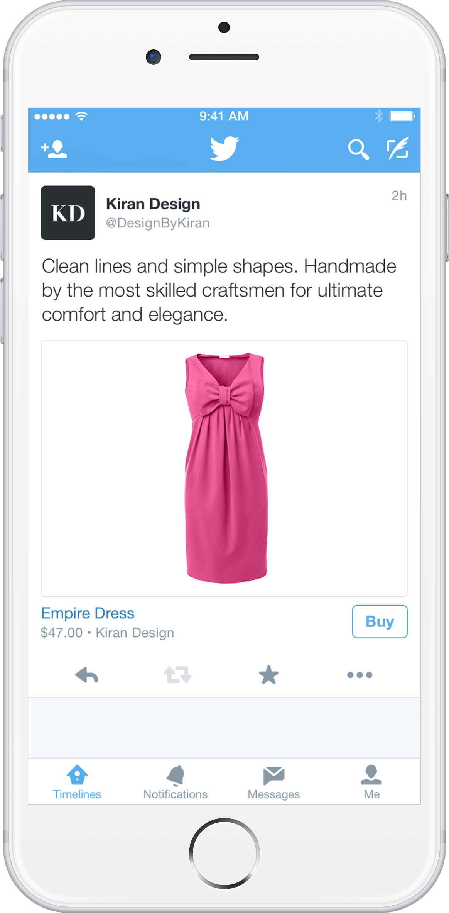
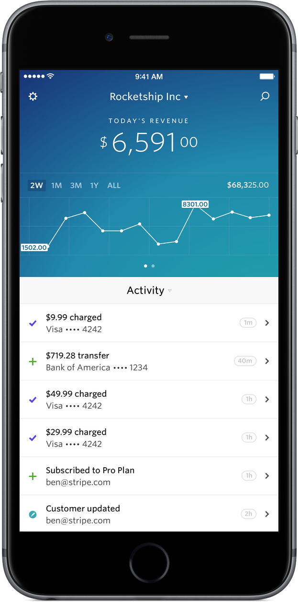
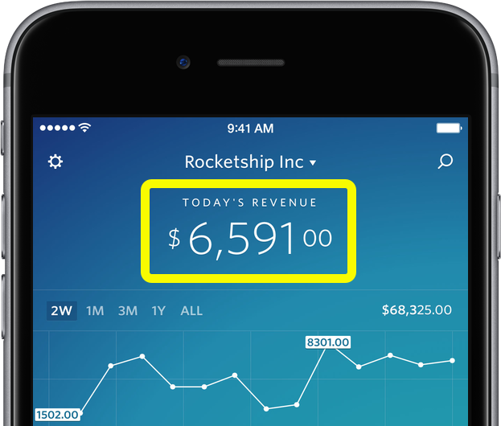

# 𝚫

^ Hi, I'm Jack Flintermann! Today I want to talk to you about change.
^ TODO some kind of warm-up?

---


^ Talk a little bit about Stripe

---



---


---



^ Not here to talk about that - wanted to think about "realtime"
^ So, Stripe has an iOS dashboard app that I work on. If you have a business on Stripe, it lets you keep tabs on it in real time. You can watch, or get notified, as new payments come in and new customers sign up for your service.
^ I'm going to try and talk about a lot of different topics today that all add up to a neat thing we built for that app.
^ Just a note - while we're going to be talking about an iPhone app, this is all equally applicable to Android/JS.

---

```swift
bind(label.text, currentUser.dailyRevenue) // easy!
```



^ So, I said that this app lets you monitor your business in real time. What does this actually mean?
^ It dynamically adjusts to changing values over time.
^ So let's assume we have an API to fetch the user's revenue for the day.
^ Straightforward to talk about binding a label's text to a value
^ Think of the set of all values of this value as a Stream

---


```swift
bind(tableView.rows, currentUser.recentEvents) // not as easy.
```

^ Now, let's also imagine we have an API to fetch our recent activity. And this'll return an array of Event objects. Side note, we're not actually imagining anything - one thing I really like about our dashboard app is that it's built entirely off the public Stripe API, which has a lot of advantages. For one, as we add new APIs for the app, everyone benefits from them.

---

## `Stream<String>`
### vs
## `Stream<Array<String>>`

^ Unfortunately, we have a small problem, which is that we're dealing with different data types. Our label's contents will be a stream of strings over time, but our table's contents will be a string of arrays of strings over time. To understand why this is annoying, let's talk about UITableView.

---

# UITableView

- `reloadData`

^ UITableView = 60% of the UI of every iOS app.
^ It has this method, reloadData, which sounds pretty close to what we want! We can fetch data from our server, and turn that JSON array into a bunch of row values, then tell the tableView to use these rows as its new data source, and then call reloadData on it. But this approach has a problem. reloadData reloads the entire table, which can cause it to flicker and be slow to draw. It'll also make your user lose their scroll position.

---

# UITableView

- `insertRowsAtIndexPaths:`
- `deleteRowsAtIndexPaths:`

^ Fortunately, it has some other methods - insert/delete rows at index paths. So here you'd say, I want to insert a new row at index 1, and delete a row at index 4. This sounds more like what we want! But, unfortunately, we don't have this information. All we have are a bunch of arrays over time.

---

# Or do we?

* `t0: [ '$5 payment', 'new user' ]              `
* `t1: [ '$5 payment', 'new user', '$1 payment' ]`

---

# `diff`

^ You've all probably used the `diff` command in some form or another. The most common use I can think of is while using git. This is the utility that powers, among other things, github pull requests. Have you ever wondered how it actually works?

---

# LCS

## **T**W**I**TT**E**R
## S**T**R**I**P**E**   
## **TIE**            

^ It turns out, diff is directly reducible to the Longest Common Subsequence problem. This problem states, given two sequences of values, find the longest not-necessarily-consecutive subsequence that they both share. So, for example, if our two inputs are TWITTER and STRIPE, the longest common subsequence is TIE.

---

## LCS -> Diff

### **T** (-W) **I** (-T) (-T) **E** (-R) -> **TIE**
### (+S) **T** (+R) **I** (+P) **E** -> S**T**R**I**P**E**


^ Once we have our longest common subsequence, it's actually almost trivial to get the diff of our original inputs. We can represent a "diff" between two arrays, x and y, to be two arrays: one is an array of indices to delete from x to transform it to the LCS of x and y, and the other is an array of indices to insert into the LCS to transform it into y.

---

```swift
func longer<T: Equatable>(a: [T], _ b: [T]) -> [T] {
    return a.count > b.count ? a : b
}

func lcs<T: Equatable>(x: [T], _ y: [T]) -> [T] {
    return lcs(x, y, x.count - 1, y.count - 1)
}

func lcs<T: Equatable>(x: [T], _ y: [T], _ i: Int, _ j: Int) -> [T] {
    if i == -1 || j == -1 {
        return []
    }
    if x[i] == y[j] {
        return lcs(x, y, i - 1, j - 1) + [x[i]]
    }
    return longer(lcs(x, y, i, j - 1), lcs(x, y, i - 1, j))
}

^ So, I have to have at least one inscrutable code slide in this talk.
^ Generics

```

---

## Back to our problem

^ So now, we have our two arrays of feed entries. We now have an algorithm to convert those two arrays into a Diff, which contains indices that we can just hand directly to UITableView. So now, we'll get this lovely animation as we add or remove individual cells from our table view.

---

## Dwifft

### github.com/jflinter/Dwifft

### `bind(tableViewDiffCalculator.rows, user.recentEvents)`

^ We went on to open-source this library, and I've found it useful in almost every side project I've worked on since. It's called Dwifft, short for Swift Diff! It contains all of the algorithms described above, as well as a few utility classes to wire this into your app really easily. Specifically, it contains a class called TableViewDiffCalculator, which wraps a UITableView. It has a property called `rows`, and when you update that property, it'll automatically calculate the diff between its previous value and animate the changes to its tableView. It's pretty neat!

---

# Questions?
## @jflinter

- Dwifft
- Stripe
- iOS
